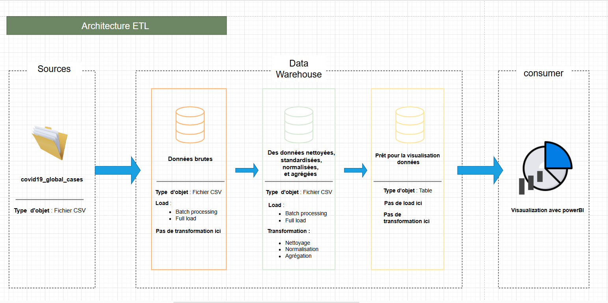
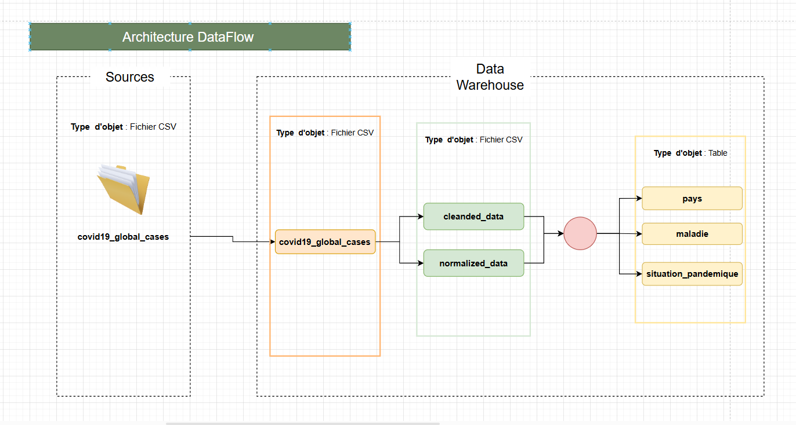

# MSPR : Développement et déploiement d'une application dans le respect du cahier des charges Client

1. Création d'un backEnd métier permettant le nettoyage et la visualisation des données.
2. Mise en place d'un processus ETL (covid-19)

 

  